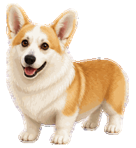
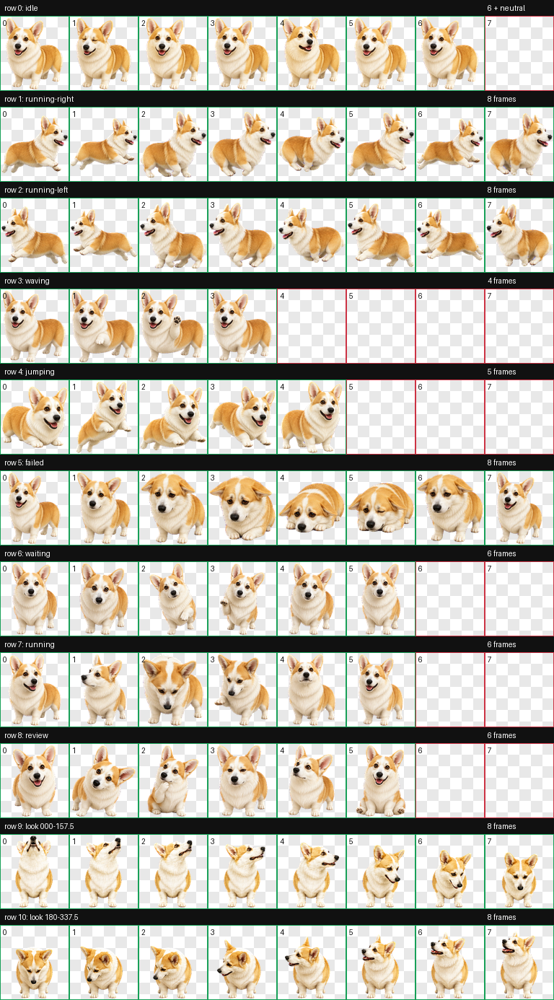

<p align="center"></p>

<h1 align="center">Kesha - Codex Pet</h1>

<p align="center">
  A tiny tan-and-white corgi who is always ready to supervise your code.
</p>

Kesha has enormous satellite-dish ears, very short legs, and a very serious commitment to helping. She trots while Codex works, waits politely when input is needed, celebrates progress, and keeps a curious eye on your cursor.

This repository contains a ready-to-install custom pet for the ChatGPT desktop app and compatible Codex CLI environments.

## Highlights

- Smooth idle, movement, waving, jumping, waiting, working, review, and failure animations
- Dedicated left- and right-facing movement
- Sixteen clockwise look directions for cursor tracking
- Transparent WebP atlas with clean edges
- Codex pet format v2: 8 columns × 11 rows, 1536 × 2288 pixels
- Original reference photos are not included

## Install

### Windows

```powershell
git clone https://github.com/vanilla-wave/kesha-codex-pet.git
cd kesha-codex-pet
powershell -ExecutionPolicy Bypass -File .\scripts\install.ps1
```

### macOS or Linux

```sh
git clone https://github.com/vanilla-wave/kesha-codex-pet.git
cd kesha-codex-pet
sh ./scripts/install.sh
```

The installers copy only `pet.json` and `spritesheet.webp` into `${CODEX_HOME}/pets/kesha`. When `CODEX_HOME` is not set, they use `~/.codex`.

After installation:

1. Open **Settings → Pets** in the ChatGPT desktop app.
2. Select **Refresh**.
3. Choose **Kesha**.
4. Use `/pet` to wake or tuck away your companion.

## Install from a release

Download `kesha-codex-pet-v1.0.0.zip` from the latest GitHub Release. Extract it, then copy the included `kesha` folder into:

- Windows: `%USERPROFILE%\.codex\pets\`
- macOS/Linux: `~/.codex/pets/`

The final layout should be:

```text
~/.codex/pets/kesha/
├── pet.json
└── spritesheet.webp
```

## Compatibility

This package uses the local v2 pet format with two additional rows for sixteen look directions. It is intended for the ChatGPT desktop app and compatible Codex CLI pet renderers.

ChatGPT web currently accepts uploaded custom pets as a single 1536 × 1872 PNG or WebP, so this 1536 × 2288 v2 package is not intended for the web upload field. See the [official Pets documentation](https://learn.chatgpt.com/docs/pets) for current platform details.

## Animation sheet



## Package contents

```text
pet/
├── pet.json
└── spritesheet.webp
```

The atlas has been validated for dimensions, transparency, required frame occupancy, left-facing motion, and look-direction continuity.

## Credits

Kesha is based on a real and extremely good corgi. The animated pet was created with the bundled `hatch-pet` workflow for Codex.

This is a community project and is not affiliated with or endorsed by OpenAI.
