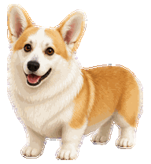

<p align="center"></p>

<h1 align="center">Kesha - Codex Pet</h1>

<p align="center">
  A tiny tan-and-white corgi who is always ready to supervise your code.
</p>

Kesha has enormous satellite-dish ears, very short legs, and a very serious commitment to helping. She trots while Codex works, waits politely when input is needed, celebrates progress, and keeps a curious eye on your cursor.

This repository contains ready-to-install custom pet packages for the ChatGPT desktop app and Codex CLI.

## Highlights

- Smooth idle, movement, waving, jumping, waiting, working, review, and failure animations
- Dedicated left- and right-facing movement
- Sixteen clockwise look directions for desktop cursor tracking
- Transparent WebP atlases with clean edges
- Desktop format v2: 8 columns × 11 rows, 1536 × 2288 pixels
- Terminal format: 8 columns × 9 rows, 1536 × 1872 pixels
- Original reference photos are not included

## Install

Clone the repository first:

```sh
git clone https://github.com/vanilla-wave/kesha-codex-pet.git
cd kesha-codex-pet
```

### ChatGPT desktop app

The desktop package includes cursor-tracking animations.

#### Windows

```powershell
powershell -ExecutionPolicy Bypass -File .\scripts\install.ps1
```

#### macOS or Linux

```sh
sh ./scripts/install.sh
```

The desktop installers copy only `pet.json` and `spritesheet.webp` into `${CODEX_HOME}/pets/kesha`. When `CODEX_HOME` is not set, they use `~/.codex`.

After installation:

1. Open **Settings → Pets** in the ChatGPT desktop app.
2. Select **Refresh**.
3. Choose **Kesha**.
4. Use `/pet` to wake or tuck away your companion.

### Codex CLI terminal

The terminal package contains the nine animation rows supported by Codex CLI.

#### Windows

```powershell
powershell -ExecutionPolicy Bypass -File .\scripts\install-terminal.ps1
```

#### macOS or Linux

```sh
sh ./scripts/install-terminal.sh
```

The terminal installers copy only `pet.json` and `spritesheet.webp` into `${CODEX_HOME}/pets/kesha-terminal`. When `CODEX_HOME` is not set, they use `~/.codex`.

The final layout is:

```text
~/.codex/pets/kesha-terminal/
├── pet.json
└── spritesheet.webp
```

After installation, open an interactive Codex CLI session, enter `/pets`, and choose **Kesha (Terminal)**. Terminal pets require iTerm2 3.6 or newer, or a terminal with Kitty graphics or Sixel support. They are unavailable inside tmux and Zellij.

## Install the desktop package from a release

Download `kesha-codex-pet-v1.0.0.zip` from the latest GitHub Release. Extract it, then copy the included `kesha` folder into:

- Windows: `%USERPROFILE%\.codex\pets\`
- macOS/Linux: `~/.codex/pets/`

The final layout should be:

```text
~/.codex/pets/kesha/
├── pet.json
└── spritesheet.webp
```

## Compatibility

The desktop package uses the local v2 pet format with two additional rows for sixteen look directions. The terminal package uses the first nine standard animation rows in the fixed 1536 × 1872 layout expected by Codex CLI.

ChatGPT web accepts uploaded custom pets as a single 1536 × 1872 PNG or WebP, so the 1536 × 2288 desktop package is not intended for the web upload field. See the [official Pets documentation](https://learn.chatgpt.com/docs/pets) for current platform details.

## Animation sheet


## Package contents

```text
pet/
├── pet.json
└── spritesheet.webp

pet-terminal/
├── pet.json
└── spritesheet.webp
```

Both atlases have been validated for dimensions, transparency, required frame occupancy, and left-facing motion. The desktop atlas also includes validated look-direction continuity.

## Credits

Kesha is based on a real and extremely good corgi. The animated pet was created with the bundled `hatch-pet` workflow for Codex.

This is a community project and is not affiliated with or endorsed by OpenAI.
